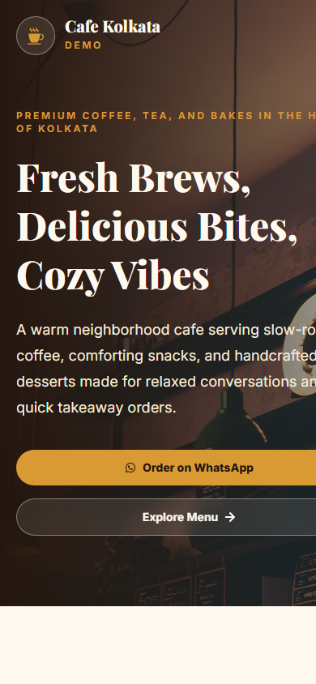

# Cafe Kolkata Demo

A premium cafe landing page and QR menu demo built for local restaurant and cafe businesses. Cafe Kolkata Demo showcases a modern single-page website with WhatsApp ordering, downloadable QR code support, polished menu presentation, gallery visuals, contact details, and Vercel-ready deployment.

This project is designed as a realistic client demo that can be shown to cafe owners as a paid website product concept.

## Screenshots

### Homepage


### Menu Section


### Mobile View



## Features

- Modern premium cafe landing page
- Fully responsive mobile-first layout
- Hero section with strong brand positioning
- WhatsApp order buttons across the page
- Floating WhatsApp quick-action button
- QR code generation for the live demo URL
- Downloadable QR code image
- Realistic cafe menu with INR pricing
- Coffee, tea, snacks, and dessert categories
- About section with cafe story and value cards
- Responsive gallery with hover interactions
- Contact section with address, phone, hours, and map embed
- Clean footer with social links
- Smooth animations using Framer Motion
- Production-ready Vite build
- No backend, database, authentication, or unnecessary infrastructure

## Tech Stack

- React
- Vite
- Tailwind CSS
- JavaScript
- React Icons
- Framer Motion
- qrcode.react

## Project Structure

```text
cafe-kolkata-demo/
├── public/
│   └── screenshots/
│       ├── homepage.png
│       ├── menu.png
│       └── mobile.png
├── src/
│   ├── assets/
│   ├── components/
│   ├── pages/
│   ├── App.jsx
│   ├── main.jsx
│   └── styles.css
├── index.html
├── package.json
├── postcss.config.js
├── tailwind.config.js
└── vite.config.js
```

## Getting Started

### Prerequisites

Install Node.js 18 or newer.

Check your versions:

```bash
node --version
npm --version
```

### Installation

Clone the repository:

```bash
git clone https://github.com/your-username/cafe-kolkata-demo.git
cd cafe-kolkata-demo
```

Install dependencies:

```bash
npm install
```

Start the development server:

```bash
npm run dev
```

Open the local URL shown in the terminal, usually:

```text
http://localhost:5173
```

## Available Scripts

Run the app locally:

```bash
npm run dev
```

Create a production build:

```bash
npm run build
```

Preview the production build:

```bash
npm run preview
```

## WhatsApp Ordering

All WhatsApp buttons open this order link:

```text
https://wa.me/919000000000?text=Hi%20I%20want%20to%20order%20from%20Cafe%20Kolkata%20Demo
```

Update the phone number and message in:

```text
src/components/data.js
```

## QR Code

The QR code points to:

```text
https://cafekolkata-demo.vercel.app
```

Update the QR destination in:

```text
src/components/data.js
```

## Deployment

### Deploy to Vercel

1. Push the project to GitHub.
2. Go to [Vercel](https://vercel.com).
3. Click **Add New Project**.
4. Import the GitHub repository.
5. Keep the framework preset as **Vite**.
6. Use the following settings:

```text
Build Command: npm run build
Output Directory: dist
Install Command: npm install
```

7. Click **Deploy**.

After deployment, update the QR target in `src/components/data.js` if your final Vercel URL is different.

## Customization

Common client-specific edits:

- Replace cafe name and brand copy
- Update menu items and prices
- Add real food and interior photos
- Replace the WhatsApp phone number
- Update the address and opening hours
- Swap the Google Maps embed location
- Add real social media profile links
- Replace placeholder screenshot images

## Production Notes

This app is intentionally frontend-only. It is suitable for a fast cafe website demo, QR menu landing page, or WhatsApp ordering funnel without requiring a backend.

For a real client launch, connect the domain in Vercel, replace placeholder content, use real photography, and test the WhatsApp order flow on mobile before publishing.

## License

This project is available for demo and client presentation use.
